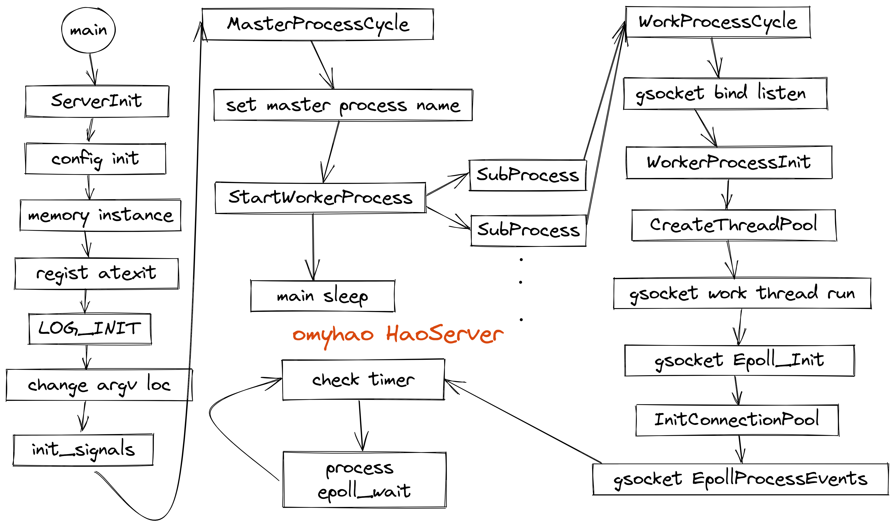

# HaoServer 
## 特性
Linux下 多进程 C++ WebServer，业务服务器。

- 基于配置文件
    - 可加注释的简易json配置文件解析
    - 基于C++17 std::variant 
- 使用线程池异步处理任务和发送数据
- 使用连接池来减少连接建立释放时间
- CRC算法进行数据校验
- 自定义消息格式
- 基于最小堆的定时器
- 可检测flood攻击
- 可以守护进程运行
- 自定义进程名
- 简易C++ stream 格式的同步日志
    - 高性能多线程异步日志[HaoLog](https://github.com/omyhao/HaoLog)


## 思路


## 一些有用的代码
- 统计代码行数

    `cloc . --exclude-list-file=.clocignore`

- 查看进程状态

    `ps -aux | grep "进程名"`

- 查看cpu占用
    
    `top 进程名`

    `top -p 进程id`

- printf()无缓冲输出
    
    `setvbuf(stdout, NULL, _IONBF, 0);`

## 遇到的一些问题
1. 构造函数中的默认值
    
    函数参数默认值应该在声明中，而不是定义中

2. switch case中定义变量的问题
    ```cpp
    switch (addr_.sa_family)
    {
        case AF_INET:
            ::inet_ntop(AF_INET, &addr4_.sin_addr, buffer, 64);
            size_t end = ::strlen(buffer);
            uint16_t port = be16toh(addr4_.sin_port);
            snprintf(buffer+end, 64-end, ":%u", port);
            break;
        
        case AF_INET6:
            ::inet_ntop(AF_INET, &addr6_.sin6_addr, buffer, 64);
            size_t end = ::strlen(buffer);
            uint16_t port = be16toh(addr6_.sin6_port);
            snprintf(buffer+end, 64-end, ":%u", port);
        default:
            ::strncpy(buffer, "Unknown AF", 64);
            break;
    }
        
    // 上面这样写就会报错
    // 下面这样写就不会了
    switch (addr_.sa_family)
    {
        case AF_INET:
            {
                ::inet_ntop(AF_INET, &addr4_.sin_addr, buffer, 64);
                size_t end = ::strlen(buffer);
                uint16_t port = be16toh(addr4_.sin_port);
                snprintf(buffer+end, 64-end, ":%u", port);
            }
            
            break;
        
        case AF_INET6:
            {
                ::inet_ntop(AF_INET, &addr6_.sin6_addr, buffer, 64);
                size_t end = ::strlen(buffer);
                uint16_t port = be16toh(addr6_.sin6_port);
                snprintf(buffer+end, 64-end, ":%u", port);
            }
            
        default:
            ::strncpy(buffer, "Unknown AF", 64);
            break;
    }
    // 或者将变量提到switch之前
    ```

3. 头文件循环引用
    
    会出现does not name a type 这样的问题

4. 构造函数
    
    当类有了自定义的构造函数，那么默认的空参数构造函数则不会自动生成，而这个类作为其他类的成员变量时，也会抑制这个类的默认构造函数的生成

5. 不允许指针指向不完整的类类型

6. 前置声明的问题

    在一个.h中使用了前置声明，.cpp文件中引用了实际的头文件,但是两个类不在同个命名空间的时候，就会报这个错,所以前置声明里要加命名空间前缀

7. 使用enum作为返回值

    需要类名::enum名的全路径作为返回值


8. "integer[pointer-to-object]" 的解决问题

    https://stackoverflow.com/questions/31269522/2-overloads-have-similar-conversions-built-in-operator-integerpointer-to-obje

    https://stackoverflow.com/questions/60068103/more-than-one-operator-matches-these-operands

9. 无法解析的外部符号
    一般就是类函数没有实现，

10. 当一个类中使用了自定义类型时，而cpp文件中使用这个自定义类型作为返回值时,需要使用类名前缀指定这个新类型
    ```cpp
    ClassName::newtype func()
    {
        
    }
    ```
11. 简易的echo服务器
    ```cpp
    sudo ncat -l 80 --keep-open --exec "/bin/cat"
    ```
12. 惊群导致的Resource temporarily unavailable
    
    监听端口的打开应该是在fork之后,然后设置监听socket的so_reuseport属性就可以避免了
    
# 可思考改进的点
1. 可以使用async来进行配置文件的异步加载
2. 是应该启用单独的计时器线程，还是使用epoll线程一起用就行
3. Memory类，出来的指针可以使用unique_ptr来代替
4. 代码里暂时用到内存的动态释放是连接里用户数据的获取，其实如果数据大小是提前固定的话，可以用一个bufer来进行提前的申请
5. 多进程异步日志的实现

# 代码统计

|Language|files|blank|comment|code|
|---|---|---|---|---|
|C++|19|403|399|3358|
|C/C++ Header|16|203|181|962|
|SUM:|35|606|580|4320|